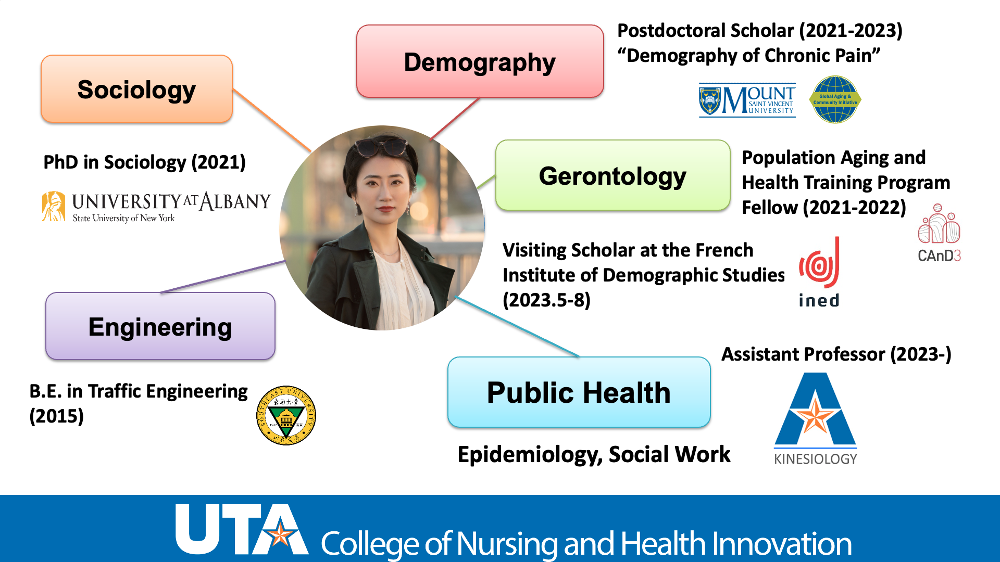

### Feinuo Sun, Ph.D.
Assistant Professor\
Public Health Program, Department of Kinesiology\
College of Nursing and Health Innovation\
The University of Texas at Arlington\
Maverick Activities Center (MAC) 227\
Box 19259, 500 W. Nedderman Drive, Arlington, Texas 76019\
Email: feinuo.sun@uta.edu\
My [CV](https://github.com/feinuosun/she-lab/blob/main/assets/images/CV_Sun_Feb%202024.pdf)

# Research fellows

### Rui (Zoe) Huang
PhD Candidate\
Department of Sociology\
University at Buffalo, State University of New York

### Akib Zaman
PhD in Computer Science\
The University of Texas at Arlington

# Graduate Research Assistants
TBD
# Undergraduate Research Assistants
TBD

# Lab Alumni
Anika Tasnim Khan (GRA)

