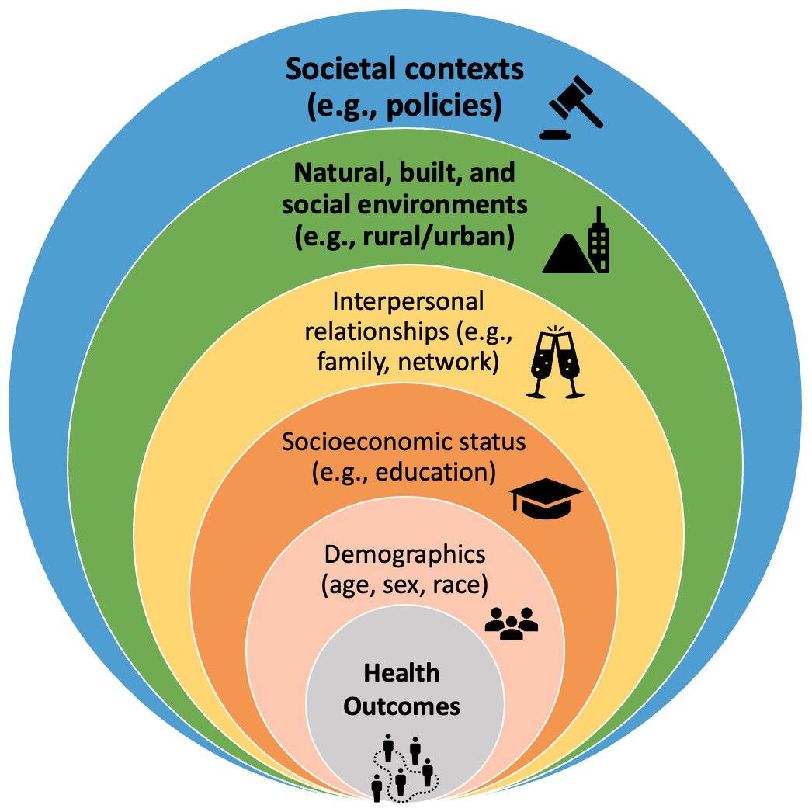

Our research fits in the broad framework of Social Determinants of Health (SDOH). The framework incorporates *demographic characteristics* (i.e., age, sex, and race), *socioeconomic status* (e.g., education and income), *interpersonal relationships* (e.g., family arrangements and social networks), *natural, built, and social environments* (e.g., place-based characteristics, such as rural-urban residence), as well as *societal contexts* (e.g., policies, laws, and social norms). 

Our current research is mainly about the **spatial/geographic dimension** (the first two highest levels in the SDOH framework) of chronic pain outcomes among older adults. We focus on both individual- and ecological-level outcomes.

 
## Rural-Urban Difference in Pain
The project fills the literature gap in rural-urban pain differences by examining the rural-urban and within-rural disparities in pain outcomes and how compositional and contextual factors explain these disparities. We focus on not only how people's pain develop but also how they manage pain differently under different contexts. The findings would be critical for policymaking and resource allocation to address health disparities and promote healthy aging. 

## State-Level Policies and Pain
Research on how sociopolitical contexts impact people's pain outcomes is limited. This study examines unanswered questions about how state policies, such as SNAP, minimum wage, and tobacco tax, shape pain outcomes. We use national datasets such as the Behavioral Risk Factor Surveillance System and State Policy & Politics Database.

## Natural Environments and Pain
The goal of this project is to understand how natural-environmental conditions of neighborhoods shape pain outcomes among older adults. The aims include: 1) how long-term, even lifetime exposure, to environmental hazards through the life course shapes pain disparities among older adults; 2) how neighborhood environmental hazards shape pain outcomes differently for different groups. 

## County-Level Analysis of Pain Prevalences
This project will map the county-level distributions of five different types of chronic pain conditions and explore the county-level factors that may shape these distributions.
